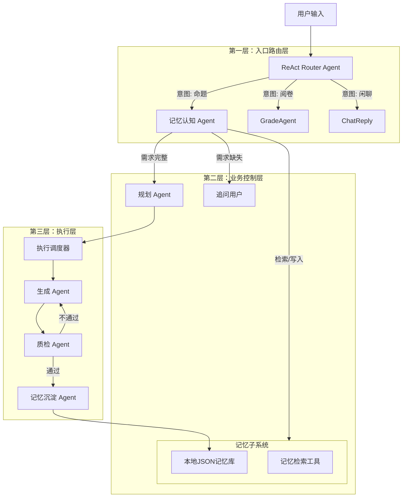

# IntelliExam-Agent：自主决策型命题专家组系统 - 完整开发设计方案

## 1. 项目概述

### 1.1 核心愿景

构建一个 AI Native 的命题辅助系统。该系统不仅是执行指令的工具，更是一个具备记忆能力和专家思维的智能体。系统能够通过多轮对话引导用户明确需求，利用双层记忆架构积累经验，并通过多智能体协作实现试题的生成、自检与修正。

### 1.2 关键特性

- **对话式交互**：摒弃传统表单，通过自然语言交互，过程透明可视。
- **双层记忆架构**：
  - 短期记忆：维持当前会话上下文。
  - 长期记忆：基于本地 JSON 持久化，支持跨会话的用户偏好学习与经验检索。
- **认知驱动需求分析**：利用 LLM 的推理能力替代僵化的槽位填充，基于记忆自主判断需求完整性。
- **反思闭环**：引入 "命题-质检-修正" 的循环机制，确保试题科学性。

### 1.3 技术栈

- **后端框架**: Python 3.10+
- **Agent 框架**: LangChain (Core, OpenAI) + LangGraph (状态机核心)
- **前端框架**: Streamlit (快速构建对话式 UI)
- **向量数据库**: Chroma (轻量级本地存储) 或 Qdrant
- **模型**: 兼容 OpenAI API 格式 (推荐 DeepSeek-V3 / GPT-4o)
- **持久化**: 本地 JSON 文件 (长期记忆存储)

---

## 2. 产品形态与交互设计

### 2.1 交互理念：透明的思考过程

前端不仅是结果展示，更是 Agent 思维过程的可视化面板。

### 2.2 界面布局

**左侧栏：**
- 知识库管理：上传 PDF/Docx，点击向量化。
- 配置：模型选择、记忆库查看入口。

**主区域：**
- 对话窗口。
- 关键组件：使用 st.status 展示 Agent 内部动作（如："正在检索记忆"、"正在规划任务"、"正在修正试题"）。

### 2.3 交互流程演示

```
用户：帮我出两道导数题。

系统：
*UI 显示*：💡 正在检索长期记忆... -> 找到偏好：[难度偏好：困难]。
*UI 显示*：🧠 正在分析需求... -> 发现题型未指定，但难度已推断为困难。
*Agent 回复*：好的，根据您的偏好，我准备生成两道困难难度的导数题。请问题型是选择题还是解答题？

用户：选择题。

系统：
*UI 显示*：✅ 需求确认 -> 📝 规划任务 -> ✍️ 生成试题 -> 🧐 质量审核。
*UI 显示 (折叠面板)*：⚠️ 审核发现问题：第1题选项逻辑矛盾，正在修正...
*最终输出*：渲染精美的试题卡片。
```

---

## 3. 系统架构设计

系统采用 **分层多智能体架构**，通过 LangGraph 进行状态流转。

### 3.1 架构分层图



---

## 4. 核心数据结构定义

### 4.1 全局状态

这是 LangGraph 流转的核心数据载体。

```python
from typing import TypedDict, List, Optional, Annotated, Literal
import operator

class AgentState(TypedDict):
    # === 输入输出 ===
    user_input: str
    chat_history: Annotated[List[dict], operator.add]  # 短期记忆
    final_response: str

    # === 路由状态 ===
    intent: Literal["proposition", "grading", "chat"]

    # === 命题业务状态 ===
    # 记忆认知层产出
    retrieved_long_term_memory: List[str]  # 从JSON检索到的历史经验
    extracted_params: dict  # {"topic": "导数", "difficulty": "hard", "count": 5}
    is_info_complete: bool  # Agent 自主判断的结果

    # 执行层状态
    plan_steps: List[str]
    current_step_index: int
    retrieved_knowledge: str  # RAG检索到的业务知识

    # 生成与反思状态
    draft_questions: List[dict]
    audit_feedback: str
    revision_count: int
```

### 4.2 长期记忆数据结构

存储于 `data/memory/long_term_memory.json`。

```json
[
    {
        "id": "mem_001",
        "timestamp": "2023-10-27T10:00:00",
        "type": "user_preference",
        "content": "用户偏好难度为 0.8 以上的理科试题",
        "metadata": {"source": "session_abc"}
    },
    {
        "id": "mem_002",
        "timestamp": "2023-10-27T11:00:00",
        "type": "task_experience",
        "content": "曾成功生成过关于'牛顿第二定律'的竞赛级选择题，用户非常满意",
        "metadata": {"rating": 5}
    }
]
```

---

## 5. 详细模块设计

### 5.1 记忆管理子系统

**文件**: `utils/memory_manager.py`

**功能**：管理本地 JSON 文件的读写。

**核心方法**：
- `retrieve_memory(query, top_k)`: 根据关键词或向量相似度检索历史记忆。
- `save_memory(content, type)`: 将总结好的经验写入 JSON 文件。
- `get_all_memories()`: 用于后台管理查看。

### 5.2 第一层：入口路由 Agent (ReAct)

**文件**: `agents/router_agent.py`

**职责**：意图识别与分发。

**Prompt 要点**：
```
你是路由器。判断用户意图：
1. 出题/命题 -> transfer_to_proposition
2. 阅卷/评分 -> transfer_to_grading
3. 其他 -> direct_reply
```

### 5.3 第二层：记忆认知 Agent (Memory Cognitive Agent)

**文件**: `agents/memory_agent.py`

**职责**：替代传统槽位填充。利用长期记忆和上下文推理需求。

**流程**：
1. **召回**：调用 `memory_manager.retrieve_memory(user_input)` 获取用户历史偏好。
2. **推理**：结合 `chat_history` (短期) 和 `retrieved_long_term_memory` (长期)，让 LLM 判断当前需求是否完整。
3. **输出**：结构化 JSON (CollectorOutput)。
   - 若缺失：生成追问。
   - 若完整：输出 `extracted_params`（此时已自动融合了用户显式输入和记忆中的隐式偏好）。

**Prompt 模板**：
```
# Role
你是命题需求分析师。

# Long-Term Memory (历史偏好)
{retrieved_long_term_memory}

# Current Context (当前对话)
{chat_history}

# Task
分析用户最新输入: {user_input}
结合历史偏好，判断命题要素(知识点、数量、难度、题型)是否齐全。
如果用户未明确指定，优先使用 Long-Term Memory 中的偏好进行补全。
如果仍缺失，生成追问。
```

### 5.4 第二层：规划 Agent (Planner)

**文件**: `agents/planner_agent.py`

**职责**：将确认的需求拆解为执行计划。

**逻辑**：
- Input: `state['extracted_params']`
- Output: `state['plan_steps'] = ['检索业务知识', '生成试题', '质量审核', '记忆沉淀']`

### 5.5 第三层：执行层 - 协作闭环

**文件**: `agents/executor_agent.py`

包含三个核心节点：

**Creator Node (生成)**：
- 调用 RAG 工具检索业务知识库。
- 根据 `extracted_params` 生成试题。

**Auditor Node (审核)**：
- Prompt: `"检查试题 {draft_questions}。是否存在科学性错误？是否符合难度要求？"`
- 逻辑：若不通过，`revision_count += 1`，回退到 Creator Node 重试（上限3次）。

**Consolidator Node (记忆沉淀)**：
- **触发条件**：试题通过审核且生成完毕。
- **逻辑**：
  - Prompt: `"总结本次对话中体现的用户新偏好或成功的命题经验。"`
  - Action: 调用 `memory_manager.save_memory()` 写入 JSON 文件。
- **意义**：实现 Agent 的自我进化。

---

## 6. 前端交互设计

### 6.1 布局结构

- **Sidebar**: 知识库上传、模型配置、"查看我的记忆"按钮。
- **Main Area**: 对话界面。

### 6.2 关键交互代码逻辑

```python
# app.py 示例逻辑
with st.chat_message("assistant"):
    with st.status("正在思考...", expanded=True) as status:
        # 1. 路由阶段
        st.write("🧠 正在分析意图...")
        intent = router_node(state)

        if intent == "proposition":
            # 2. 记忆召回阶段
            st.write("💡 正在回忆您的偏好...")
            state = memory_recall_node(state)

            # 3. 需求分析阶段
            st.write("📝 正在分析需求...")
            state = cognitive_node(state)

            if not state['is_info_complete']:
                st.write("❓ 需要更多信息，正在追问...")
                st.markdown(state['final_response'])
            else:
                # 4. 执行阶段
                st.write("🔍 正在检索知识库...")
                st.write("✍️ 正在生成试题...")
                st.write("🧐 正在进行质量审核...")

                if audit_fail:
                    st.write("⚠️ 发现问题，正在修正...")

                # 5. 记忆沉淀 (后台静默)
                st.write("💾 正在保存本次经验...")
                consolidator_node(state)

                status.update(label="命题完成", state="complete")
                st.markdown(state['final_response'])
```

---

## 7. 项目目录结构

```
IntelliExam-Agent/
├── app.py                     # Streamlit 入口
├── agents/
│   ├── __init__.py
│   ├── router_agent.py        # 入口路由
│   ├── memory_agent.py        # 记忆认知 Agent (核心)
│   ├── planner_agent.py       # 规划 Agent
│   ├── executor_agent.py      # 执行器
│   └── consolidator_agent.py  # 记忆沉淀 Agent
├── graphs/
│   ├── state.py               # AgentState 定义
│   └── workflow.py            # LangGraph 图构建
├── tools/
│   ├── retriever.py           # 业务知识库检索
│   └── memory_tools.py        # 长期记忆读写工具
├── utils/
│   ├── memory_manager.py      # JSON 记忆管理类
│   └── prompts.py             # Prompt 模板
├── data/
│   ├── knowledge_base/        # 业务知识库文件
│   └── memory/
│       └── long_term_memory.json # 长期记忆存储
└── requirements.txt
```

---

## 8. 开发实施计划

### Phase 1: 基础架构 (Day 1-2)

**目标**：搭建项目骨架，跑通 LangGraph 空流程。

**指令**："初始化项目结构。定义 AgentState。创建 LangGraph 包含 Router, Memory, Executor 三个空节点。"

### Phase 2: 记忆系统 (Day 3-4)

**目标**：实现本地 JSON 记忆的读写与检索。

**指令**："实现 memory_manager.py。实现 memory_tools.py 供 Agent 调用。编写简单的关键词检索逻辑。"

### Phase 3: 核心业务流 (Day 5-7)

**目标**：实现 Memory Agent (需求认知) 和 Executor (生成+审核)。

**指令**："实现 memory_agent.py，注入 Long-Term Memory 和 Chat History，输出结构化需求。实现 Creator/Auditor 循环逻辑。"

### Phase 4: 进化与闭环 (Day 8-10)

**目标**：实现 Consolidator Agent 与前端联调。

**指令**："实现 consolidator_agent.py，在任务成功后总结经验并存入 JSON。编写 Streamlit UI，展示中间过程日志。"

---

这份文档代表了当前 AI Agent 开发的最佳实践：状态驱动、记忆增强、反思进化。请严格按照此文档推进。
