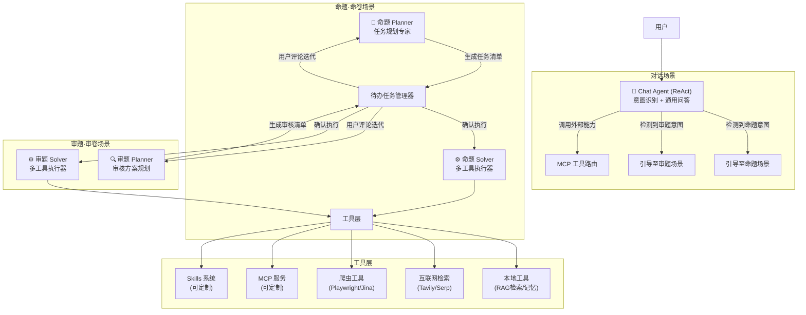

# IntelliExam-Agent v3.0：灵活自主 Multi-Agent 系统 — 开发计划与产品设计

> 文档版本：v1.0 | 生成时间：2026-03-23

---

## 一、产品设计理念与交互形态建议

### 1.1 整体定位

从"对话工具"升级为"**AI 命审题工作台**"。系统不再只是一个聊天窗口，而是一个具备专业工作流的协作平台。核心体验：**用自然语言发起任务，AI 自动规划待办，用户参与迭代，AI 执行并产出结果**。

---

### 1.2 界面形态：三区域工作台（推荐）

```
┌─────────────────────────────────────────────────────────────────────┐
│  ① 场景导航栏（顶部 Tab 或左侧导航）                                   │
│  [ 💬 对话助手 ]  [ 📝 命题·命卷 ]  [ 🔍 审题·审卷 ]                   │
├──────────────┬──────────────────────────┬───────────────────────────┤
│              │                          │                           │
│  ② 左侧面板  │    ③ 主工作区             │  ④ 右侧上下文面板           │
│  会话历史     │                          │                           │
│  ─────────  │  [场景A] 对话气泡流        │  Agent 思考过程           │
│  知识库管理  │  [场景B] 对话 + 待办看板   │  工具调用日志             │
│  ─────────  │  [场景C] 对话 + 待办看板   │  参数/结果摘要            │
│  配置/技能   │                          │  引用来源                 │
│  MCP 状态   │                          │                           │
└──────────────┴──────────────────────────┴───────────────────────────┘
```

**关键设计亮点：右侧面板在命题/审卷场景下变为「待办任务看板」。**

---

### 1.3 三场景交互设计详解

#### 场景 A：对话助手（Chat Agent）
- **形态**：纯对话气泡 + 打字机效果，与 GPT/Claude 类似
- **特点**：
  - ReAct 推理过程在右侧面板展示（思维链可见）
  - 若检测到命题或审题意图，顶部提示条引导用户切换到专业场景
  - 对话历史左侧展示，支持多会话管理
- **交互亮点**：推理步骤气泡（折叠/展开）

#### 场景 B：命题·命卷（Proposition Agent）
- **形态**：左侧是对话区，右侧是**动态待办看板**
- **交互流程**：
  ```
  用户: 帮我命一套高考数学模拟卷
       ↓
  Planner 自动生成结构化待办清单（右侧看板展示）:
  ┌─ 📋 任务：高考数学模拟卷 ─────────────────────┐
  │  ☐ [知识点分析] 覆盖必考模块（待审核）         │
  │  ☐ [题目生成] 选择题 12 道（待执行）           │
  │  ☐ [题目生成] 填空题 4 道（待执行）            │
  │  ☐ [题目生成] 解答题 6 道（待执行）            │
  │  ☐ [质量审核] 科学性+规范性审核（待执行）       │
  │  ☐ [导出] 生成 Word/PDF 文件（待执行）         │
  └───────────────────────────────────────────────┘
       ↓（用户可对每项待办评论）
  用户在「知识点分析」下添加评论：
  "请添加新课标增加的内容，重点关注统计与概率"
       ↓
  Planner 更新任务方案后，Solver 逐项执行
  每项任务执行时变为「进行中」状态，完成后展示结果预览
  ```

#### 场景 C：审题·审卷（Review Agent）
- **形态**：与命题场景相似，但待办清单由审题工作流决定
- **交互流程**：
  ```
  用户上传/粘贴试题或试卷
       ↓
  Planner 生成审题待办清单:
  ┌─ 📋 任务：高中物理试卷审核 ────────────────────┐
  │  ☐ [知识点核查] 知识点与考纲对齐分析           │
  │  ☐ [科学性审核] 物理量/单位/公式检验           │
  │  ☐ [难度评估] 难度系数分析与标注               │
  │  ☐ [答案验证] 参考答案逻辑验证                 │
  │  ☐ [表述规范] 表述规范性审查                   │
  │  ☐ [综合报告] 生成审题报告                     │
  └───────────────────────────────────────────────┘
  ```

---

### 1.4 待办看板 UI 设计规范（亮点）

```
┌──────────────────────────────────────────────────────┐
│  📋 任务名称            [展开/折叠]  [全部执行 ▶]      │
├──────────────────────────────────────────────────────┤
│  ┌── 待办卡片 ─────────────────────────────────────┐  │
│  │  🔵 [进行中]  知识点分析                        │  │
│  │  AI 正在检索课程标准...  ████████░░ 80%         │  │
│  │  ─────────────────────────────────────────────  │  │
│  │  💬 用户评论 (1)                               │  │
│  │  └ "重点关注新增统计内容" · 刚刚               │  │
│  │  [添加评论...]                                 │  │
│  └────────────────────────────────────────────────┘  │
│                                                      │
│  ┌── 待办卡片 ─────────────────────────────────────┐  │
│  │  ⚪ [待执行]  选择题生成 (12道)                  │  │
│  │  依赖：知识点分析完成后执行                      │  │
│  │  [▶ 立即执行]  [✏️ 编辑]  [💬 评论]            │  │
│  └────────────────────────────────────────────────┘  │
│                                                      │
│  ┌── 待办卡片 ─────────────────────────────────────┐  │
│  │  ✅ [已完成]  科学性审核                         │  │
│  │  通过 ✓  |  耗时 23s  |  [查看详情]             │  │
│  └────────────────────────────────────────────────┘  │
└──────────────────────────────────────────────────────┘
```

**卡片状态流转**: `待规划 → 待执行 → 进行中 → 已完成 / 需修订`

---

## 二、系统架构设计

### 2.1 Multi-Agent 架构图



### 2.2 Agent 设计规格

| Agent | 模式 | 核心能力 | MCP/Skills |
|-------|------|---------|------------|
| Chat Agent | ReAct | 意图识别、通用问答、任务转发 | ✅ 支持定制 |
| 命题 Planner | Planner | 命题工作流规划、待办生成、方案更新 | ✅ 支持定制 |
| 命题 Solver | Solver | 题目生成、RAG检索、质量审核、导出 | ✅ 支持定制 |
| 审题 Planner | Planner | 审核方案规划、分阶段任务拆解 | ✅ 支持定制 |
| 审题 Solver | Solver | 科学性验证、答案校验、报告生成 | ✅ 支持定制 |

### 2.3 待办任务数据模型

```python
class TodoTask(TypedDict):
    id: str                     # 任务 ID
    task_group_id: str          # 所属任务组
    title: str                  # 任务标题
    description: str            # 任务描述
    status: Literal[            # 状态
        "pending",              # 待规划
        "ready",                # 待执行
        "running",              # 进行中
        "done",                 # 已完成
        "need_revision"         # 需修订
    ]
    dependencies: List[str]     # 依赖的任务 ID 列表
    comments: List[Comment]     # 用户评论列表
    result: Optional[str]       # 执行结果（Markdown）
    created_at: str
    updated_at: str
    elapsed_ms: Optional[int]   # 执行耗时

class Comment(TypedDict):
    id: str
    author: str                 # "user" | "agent"
    content: str
    created_at: str
```

---

## 三、开发任务清单（分阶段）

### Phase 0：架构重构准备（约 3 天）

**目标**：在不破坏现有功能的前提下，为新架构铺路。

- [ ] **0.1** 梳理现有代码，标注哪些模块可复用（router、memory、rag、skills、mcp）
- [ ] **0.2** 设计新的 `graphs/state_v3.py`，定义统一的 AgentState（含 TodoTask 结构）
- [ ] **0.3** 设计新的场景路由机制（通过 URL 参数或 WebSocket 消息类型区分场景）
- [ ] **0.4** 设计前后端通信协议（WebSocket 消息格式 v2，含 todo_update、todo_comment 等事件）
- [ ] **0.5** 更新 [DESIGN.md](file:///e:/%E4%B8%AA%E4%BA%BA%E9%A1%B9%E7%9B%AE/exam_multi_agent/DESIGN.md)，记录 v3.0 架构决策

---

### Phase 1：待办任务管理后端（约 4 天）

**目标**：实现持久化的待办任务管理系统。

- [ ] **1.1** 创建 `models/todo.py`，定义 `TodoTask`、`TodoGroup`、`Comment` 数据类
- [ ] **1.2** 创建 `services/todo_service.py`，实现：
  - `create_task_group(session_id, title, scene)` → `TodoGroup`
  - `add_task(group_id, task_data)` → `TodoTask`
  - `update_task_status(task_id, status, result)` → `TodoTask`
  - `add_comment(task_id, comment)` → `Comment`
  - `get_group_tasks(group_id)` → `List[TodoTask]`
- [ ] **1.3** 扩展 SQLite 数据库 Schema（或 JSON 文件），添加 `todo_groups`、`todo_tasks`、`todo_comments` 表
- [ ] **1.4** 在 [server.py](file:///e:/%E4%B8%AA%E4%BA%BA%E9%A1%B9%E7%9B%AE/exam_multi_agent/server.py) 中添加 REST API：
  - `GET /api/todos/{group_id}` — 获取任务组
  - `POST /api/todos/{task_id}/comment` — 添加评论
  - `PATCH /api/todos/{task_id}/status` — 更新状态
  - `POST /api/todos/{group_id}/replan` — 触发重新规划
- [ ] **1.5** WebSocket 事件扩展：
  - `todo_group_created` — 任务组创建
  - `todo_task_update` — 单任务状态变更
  - `todo_task_result` — 任务执行完成并附结果
  - `todo_comment_added` — 新评论通知

---

### Phase 2：命题 Planner Agent（约 3 天）

**目标**：实现专业命题规划 Agent，输出结构化待办清单。

- [ ] **2.1** 创建 `agents/proposition/planner.py`：
  - System Prompt 嵌入**现代教育命题逻辑**（课标对齐、认知层次、难度梯度、题型配比）
  - 输入：用户 query + 历史评论 + 记忆偏好
  - 输出：标准 `TodoGroup` + `List[TodoTask]`（JSON）
  - 支持"重新规划"（基于用户评论修改方案）
- [ ] **2.2** 设计命题 Planner 的 Prompt 模板：
  - 融入教育部考试命题规范
  - 考虑题型配比标准（选/填/解答）
  - 考虑认知目标分层（记忆/理解/应用/分析/综合/创造）
  - 支持多学科（数学/物理/英语/语文等）
- [ ] **2.3** 实现 `agents/proposition/planner_node.py`（LangGraph 节点）：
  - 接收用户 query 和现有 todo（如有）
  - 调用 Planner 生成/更新待办
  - 通过 WebSocket 推送 `todo_group_created` 事件
- [ ] **2.4** 添加 MCP/Skills 注入接口（Planner 轻量级，主要给 Solver 用）

---

### Phase 3：命题 Solver Agent（约 5 天）

**目标**：实现执行层 Agent，逐任务调用工具完成命题任务。

- [ ] **3.1** 创建 `agents/proposition/solver.py`：
  - 接收单个 `TodoTask` → 执行 → 返回结果
  - 支持按顺序/并行执行多任务
  - 执行过程实时推送进度（`todo_task_update`）
- [ ] **3.2** 实现 Solver 工具集：
  - `rag_search_tool` — 知识库检索（复用现有 RAG）
  - `web_search_tool` — 互联网检索（Tavily/Serp）
  - `web_crawler_tool` — 爬虫检索（Jinja AI / Playwright）
  - `question_generator_tool` — 题目生成（调用 LLM）
  - `quality_auditor_tool` — 质量审核（复用现有 Auditor 逻辑）
  - `document_exporter_tool` — Word/PDF 导出
- [ ] **3.3** 实现任务依赖调度器：
  - 根据 `dependencies` 字段决定执行顺序
  - 前置任务完成后自动触发后继任务
- [ ] **3.4** 集成 MCP 工具动态注入（Solver 支持在运行时加载 MCP 工具）
- [ ] **3.5** 集成 Skills 系统（Solver 支持按任务类型加载技能）
- [ ] **3.6** 实现命题完整工作流测试（从 query 到最终试题导出）

---

### Phase 4：审题 Planner + Solver Agent（约 4 天）

**目标**：实现审题/审卷功能，复用命题架构。

- [ ] **4.1** 创建 `agents/review/planner.py`：
  - 审题 Planner，使用审题逻辑 Prompt（知识点核查、科学性、答案验证等）
  - 支持从试题文本/文件中自动提取被审内容
- [ ] **4.2** 理解并设计审题工作流（与命题工作流类似但侧重点不同）：
  - 阅题理解 → 知识图谱对齐 → 科学性验证 → 难度估算 → 答案校验 → 报告生成
- [ ] **4.3** 创建 `agents/review/solver.py`：
  - 复用 Solver 基类，追加审题专用工具：
    - `syllabus_check_tool` — 课标比对
    - `answer_verification_tool` — 答案数学/物理验证
    - `difficulty_estimator_tool` — 难度估算
    - `report_generator_tool` — 综合审题报告生成
- [ ] **4.4** 实现试题/试卷上传入口（文本粘贴 + 文件上传）
- [ ] **4.5** 完整审题工作流测试

---

### Phase 5：Chat Agent 升级（约 2 天）

**目标**：将现有 Chat Agent 改造为支持场景感知的 ReAct Agent。

- [ ] **5.1** 升级 [agents/chat_agent.py](file:///e:/%E4%B8%AA%E4%BA%BA%E9%A1%B9%E7%9B%AE/exam_multi_agent/agents/chat_agent.py)：
  - 保留 ReAct 模式
  - 添加"场景切换建议"工具（当检测到命题/审题意图时，返回引导提示）
  - 支持从对话直接创建命题/审题任务（带着上下文跳转到专业场景）
- [ ] **5.2** 实现 Chat Agent 的 MCP/Skills 动态注入
- [ ] **5.3** 为 Chat Agent 添加通用工具：
  - `web_search_tool`（复用）
  - `knowledge_query_tool`（查询知识库）
  - `memory_tool`（读写长期记忆）

---

### Phase 6：前端重设计（约 6 天）

**目标**：构建现代化的三场景工作台 UI。

#### 6.1 整体布局（约 1.5 天）
- [ ] 重构 [frontend/index.html](file:///e:/%E4%B8%AA%E4%BA%BA%E9%A1%B9%E7%9B%AE/exam_multi_agent/frontend/index.html)，实现三区域工作台布局
- [ ] 实现场景切换导航（顶部 Tab 或左侧锚点）
- [ ] 响应式布局适配（1280px+ 宽屏优先）

#### 6.2 待办任务看板组件（约 2 天，核心亮点）
- [ ] 创建 `frontend/js/todo_board.js`：
  - **TodoCard** 组件：卡片展示、状态图标、进度条
  - **CommentSection** 组件：评论输入、评论列表（用户气泡 + Agent 回复）
  - **TodoBoard** 容器：任务组管理、拖拽排序（可选）
  - 实时状态更新（WebSocket 驱动）
  - 动画：卡片状态切换、完成时绿✓动画
- [ ] 创建 `frontend/css/todo_board.css`：
  - 现代卡片设计（柔和阴影、圆角、层次感）
  - 进行中任务的脉冲动画
  - 已完成任务的视觉区分
  - 评论区折叠/展开动画

#### 6.3 对话区优化（约 1 天）
- [ ] 场景 A（对话）：ReAct 推理步骤展示组件
- [ ] 场景 B/C：对话区缩小为 1/3，待办看板占 2/3
- [ ] 添加场景切换按钮（右上角）

#### 6.4 右侧上下文面板（约 1 天）
- [ ] Agent 思考过程实时展示
- [ ] 工具调用日志（可折叠）
- [ ] 命题结果预览 + 下载按钮
- [ ] 引用来源展示（RAG 片段、网页链接）

#### 6.5 UI 细节与动画（约 0.5 天）
- [ ] 配色体系完善（深色/浅色模式）
- [ ] 过渡动画：场景切换淡入、卡片出现平移
- [ ] 空状态设计（引导用户开始任务）
- [ ] 加载骨架屏

---

### Phase 7：集成测试与优化（约 3 天）

- [ ] **7.1** 端到端测试：完整命题工作流（query → 规划 → 用户评论 → 执行 → 导出）
- [ ] **7.2** 端到端测试：完整审题工作流（上传 → 规划 → 执行 → 报告）
- [ ] **7.3** 端到端测试：Chat Agent 日常对话 + 场景跳转
- [ ] **7.4** WebSocket 稳定性测试（并发、断线重连、长任务保活）
- [ ] **7.5** 性能优化：长任务流式输出、前端虚拟滚动
- [ ] **7.6** 更新 [DEVELOPMENT_STATUS.md](file:///e:/%E4%B8%AA%E4%BA%BA%E9%A1%B9%E7%9B%AE/exam_multi_agent/DEVELOPMENT_STATUS.md) 和 [README.md](file:///e:/%E4%B8%AA%E4%BA%BA%E9%A1%B9%E7%9B%AE/exam_multi_agent/README.md)

---

## 四、技术关键决策

| 决策点 | 推荐方案 | 理由 |
|--------|---------|------|
| 待办持久化 | SQLite（已有基础） | 轻量，无需额外服务 |
| Planner 输出格式 | Structured JSON + Pydantic 验证 | 确保任务解析稳定性 |
| Solver 并发 | asyncio.gather（按依赖分批） | 利用现有异步架构 |
| 前端通信 | WebSocket（已有，扩展消息类型） | 实时推送无需轮询 |
| MCP 注入时机 | Agent 初始化时注入 | 避免运行时热加载复杂性 |
| 场景路由 | WebSocket 消息中含 `scene` 字段 | 保持单连接的简洁性 |

---

## 五、复用与改造盘点

| 现有模块 | 处理方式 |
|---------|---------|
| [agents/react_router_agent.py](file:///e:/%E4%B8%AA%E4%BA%BA%E9%A1%B9%E7%9B%AE/exam_multi_agent/agents/react_router_agent.py) | ✅ 直接复用（作为场景路由基础） |
| [agents/planner_agent_v2.py](file:///e:/%E4%B8%AA%E4%BA%BA%E9%A1%B9%E7%9B%AE/exam_multi_agent/agents/planner_agent_v2.py) | 🔄 改造为 Planner 基类 |
| [agents/executor_agent.py](file:///e:/%E4%B8%AA%E4%BA%BA%E9%A1%B9%E7%9B%AE/exam_multi_agent/agents/executor_agent.py) | 🔄 改造为 Solver 基类 |
| [agents/chat_agent.py](file:///e:/%E4%B8%AA%E4%BA%BA%E9%A1%B9%E7%9B%AE/exam_multi_agent/agents/chat_agent.py) | 🔄 升级支持场景感知 |
| [skills/registry.py](file:///e:/%E4%B8%AA%E4%BA%BA%E9%A1%B9%E7%9B%AE/exam_multi_agent/skills/registry.py) | ✅ 直接复用 |
| [utils/mcp_client.py](file:///e:/%E4%B8%AA%E4%BA%BA%E9%A1%B9%E7%9B%AE/exam_multi_agent/utils/mcp_client.py) | ✅ 直接复用 |
| `rag_engine/` | ✅ 直接复用 |
| [frontend/js/app.js](file:///e:/%E4%B8%AA%E4%BA%BA%E9%A1%B9%E7%9B%AE/exam_multi_agent/frontend/js/app.js) | 🔄 扩展 WebSocket 消息类型 |
| [frontend/js/panel.js](file:///e:/%E4%B8%AA%E4%BA%BA%E9%A1%B9%E7%9B%AE/exam_multi_agent/frontend/js/panel.js) | 🔄 改造为待办看板组件 |
| [server.py](file:///e:/%E4%B8%AA%E4%BA%BA%E9%A1%B9%E7%9B%AE/exam_multi_agent/server.py) | 🔄 添加新 API 路由 |

---

## 六、开发优先级建议

```
Week 1: Phase 0 + Phase 1（架构重构 + 待办后端）
Week 2: Phase 2 + Phase 3 前半（命题 Planner + Solver 基础）
Week 3: Phase 3 后半 + Phase 4（Solver 完整 + 审题）
Week 4: Phase 5 + Phase 6（Chat 升级 + 前端重设计）
Week 5: Phase 7（测试与优化）
```

> **建议从 Phase 1（待办系统后端）+ Phase 6.2（待办看板前端）并行开始**，因为这是最核心的差异化亮点，早期验证交互体验对后续开发方向影响最大。
