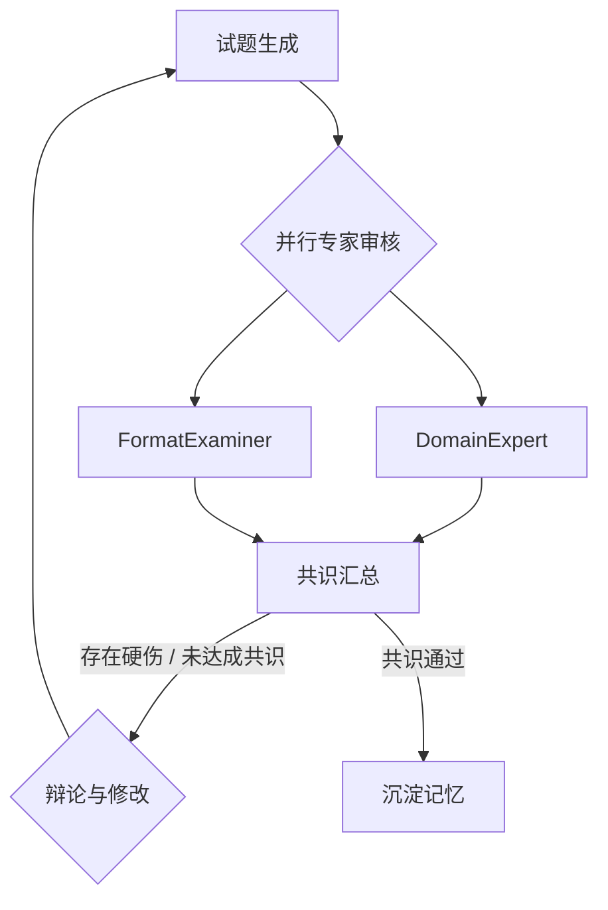

# 下阶段核心开发方案：多智能体辩论与作战室视图 (Debate War Room)

基于我们前期的探讨，为了能在面试中拿出“杀手锏”级别的功能，并在前端给用户带来极具科技感的视觉冲击，我建议下阶段的**首要开发目标**锁定为：**实现质检环节的“多智能体辩论架构 (LangGraph)”及前端配套的“动态作战室 UI”**。

这套方案不仅能体现您驾驭复杂底层图结构的能力，还能直观展示复杂系统的可观测性。

---

## 📅 第 1 阶段：后端架构演进 - LangGraph 辩论子图 (Debate Sub-Graph)

当前我们的架构中，执行层 [executor_agent.py](file:///e:/%E4%B8%AA%E4%BA%BA%E9%A1%B9%E7%9B%AE/exam_multi_agent/agents/executor_agent.py) 只包含简单的 `Creator -> Auditor`。我们需要将其升级为由一个 `Meta-Reviewer` 统筹多个 [Expert](file:///e:/%E4%B8%AA%E4%BA%BA%E9%A1%B9%E7%9B%AE/exam_multi_agent/agents/debate_experts.py#5-22) 构成的辩论拓扑。

### 1. 扩展 AgentState ([graphs/state.py](file:///e:/%E4%B8%AA%E4%BA%BA%E9%A1%B9%E7%9B%AE/exam_multi_agent/graphs/state.py))
为了支撑辩论流，我们需要在全局状态中记录各方的发言。
```python
# [ MODIFY ] graphs/state.py
class AgentState(TypedDict):
    # ... existing fields ...
    # 新增：辩论历史，用于记录专家互怼的过程
    debate_history: Annotated[List[dict], operator.add] 
    # 新增：当前共识状态
    consensus_reached: bool
```

### 2. 定义辩论节点 ([agents/debate_experts.py](file:///e:/%E4%B8%AA%E4%BA%BA%E9%A1%B9%E7%9B%AE/exam_multi_agent/agents/debate_experts.py) - 新建)
抽离原有的单体 Auditor，构建三个具体的专家 Agent（或通过 prompt 模板定义 3 种角色运行在同一个 LLM function 上）。
*   **DomainExpert (学科专家)**：专门找题目中的知识性硬伤。
*   **FormatExaminer (排版规范官)**：专门挑剔 Markdown 格式、选项编排是否符合大纲。
*   **MetaReviewer (主理人)**：不负责找茬，只负责看两边专家的意见是否一致。如果分歧太大，他会重新抛出一个问题让 Creator 再次修改。

### 3. 重构执行图逻辑 ([graphs/workflow.py](file:///e:/%E4%B8%AA%E4%BA%BA%E9%A1%B9%E7%9B%AE/exam_multi_agent/graphs/workflow.py) / [graphs/workflow_server.py](file:///e:/%E4%B8%AA%E4%BA%BA%E9%A1%B9%E7%9B%AE/exam_multi_agent/graphs/workflow_server.py))
原本的边是： `Creator -> Auditor -> Consolidator`
**新的局部拓扑 (Sub-Graph)** 将变为：

**实现细节**：利用 LangGraph 的 [Send](file:///e:/%E4%B8%AA%E4%BA%BA%E9%A1%B9%E7%9B%AE/exam_multi_agent/frontend/js/chat.js#88-99) API 或简单的扇出 (Fan-out) 并行流来同时调用两个专家节点，然后在 [MetaReviewer](file:///e:/%E4%B8%AA%E4%BA%BA%E9%A1%B9%E7%9B%AE/exam_multi_agent/agents/debate_experts.py#43-83) 节点将其 gather 汇总。

### 4. WebSocket 消息推送增强 ([server.py](file:///e:/%E4%B8%AA%E4%BA%BA%E9%A1%B9%E7%9B%AE/exam_multi_agent/server.py))
为了让前端感知到“谁在说话”，需要在后端节点每次产生一段论点时，通过 WebSocket 推送一种全新的消息体。
```python
# 示例：后端在某个 Node 运行时 send 数据
await websocket.send_json({
    "type": "debate_stream",
    "role": "domain_expert", 
    "avatar": "👨‍🏫",
    "content": "第2题的极值点计算似乎有误，导函数应为..."
})
```

---

## 🎨 第 2 阶段：前端沉浸式体验 - 动态作战室 UI (War Room)

后端的辩论虽然精彩，但也容易让耗时增加。因此前端需要用极其炫酷的动效来“掩盖”这个耗时，让用户觉得“等待是值得的，专家们真的在认真干活”。

### 1. DOM 结构设计 ([frontend/index.html](file:///e:/%E4%B8%AA%E4%BA%BA%E9%A1%B9%E7%9B%AE/exam_multi_agent/frontend/index.html))
在右侧原本的 `agent-panel` 中，当收到进入审核流的事件时，展开一个新的 `war-room-section`。
```html
<!-- [ NEW/MODIFY ] frontend/index.html -->
<div id="war-room-section" class="panel-section hidden">
  <div class="panel-section-title">
     ⚔️ 质量审核作战室 <span class="pulsing-dot"></span>
  </div>
  <div id="debate-bubbles" class="debate-container">
    <!-- 这里将由 JS 动态插入由各个专家发出的聊天气泡 -->
  </div>
</div>
```

### 2. CCS 动效支持 ([frontend/css/style.css](file:///e:/%E4%B8%AA%E4%BA%BA%E9%A1%B9%E7%9B%AE/exam_multi_agent/frontend/css/style.css))
需要手写一套类似“弹幕”或“紧凑型群聊”的样式。
```css
/* [ MODIFY ] frontend/css/style.css */
.debate-bubble {
    animation: slideUpFade 0.3s ease-out forwards;
    padding: 8px 12px;
    border-radius: 8px;
    margin-bottom: 8px;
    font-size: 0.85rem;
    display: flex;
    gap: 8px;
}
.role-badge { /* 角色标签，比如用不同的底色区分专家 */ }
@keyframes slideUpFade {
    from { opacity: 0; transform: translateY(10px); }
    to { opacity: 1; transform: translateY(0); }
}
```

### 3. JS 事件侦听与渲染 ([frontend/js/app.js](file:///e:/%E4%B8%AA%E4%BA%BA%E9%A1%B9%E7%9B%AE/exam_multi_agent/frontend/js/app.js) & [frontend/js/panel.js](file:///e:/%E4%B8%AA%E4%BA%BA%E9%A1%B9%E7%9B%AE/exam_multi_agent/frontend/js/panel.js))
捕获后端发来的 `debate_stream`。
```javascript
// [ MODIFY ] frontend/js/app.js
socket.onmessage = function(event) {
    const data = JSON.parse(event.data);
    // ... 原有逻辑 ...
    if (data.type === 'debate_stream') {
        renderDebateBubble(data.role, data.avatar, data.content);
        scrollToBottomDebateRoom();
    }
}
```

---

## 🚀 实施步骤与面试收益

### 实施路线图 (Next Steps)：
1. **(预计 1 小时)**：在 [state.py](file:///e:/%E4%B8%AA%E4%BA%BA%E9%A1%B9%E7%9B%AE/exam_multi_agent/graphs/state.py) 和 [server.py](file:///e:/%E4%B8%AA%E4%BA%BA%E9%A1%B9%E7%9B%AE/exam_multi_agent/server.py) 中扩充所需的字段和消息通道。
2. **(预计 2 小时)**：改写 [graphs/workflow_server.py](file:///e:/%E4%B8%AA%E4%BA%BA%E9%A1%B9%E7%9B%AE/exam_multi_agent/graphs/workflow_server.py)，尝试先挂载两个虚拟的（Dummy）专家节点，测试并行下发和消息汇总是否会死锁。
3. **(预计 2 小时)**：编写真实专家的 Prompt，调通后端的“造题 -> 互喷 -> 达成共识”循环。
4. **(预计 2 小时)**：联调前端，把后端的“互喷”记录在右侧面板上用漂亮的 CSS 动画一条条弹出来。

### 带来的面试绝对优势 (Killer Value)：
当你在面试中打开 Demo，敲入“帮我出两道地狱难度的微积分题”，右侧面板瞬间弹出：
*   *[学科专家]: 发现题意有歧义，不满足罗尔定理的条件。*
*   *[格式考官]: 赞同，并且公式没有用 LaTeX 规范包裹。*
*   *[Creator]: 已收到意见，正在重新构建函数体系...*
*   *[Meta-Reviewer]: 意见统一，放行。*

如果您对这份计划中的**某个技术点（比如 LangGraph 里的并行节点怎么写，或是前端动画的具体实现）**有疑惑，我们随时可以开始局部代码的编写和测试！

---

## Phase 4: 全局视觉震撼重构 (Scheme B - 现代 AI 工具风)

在完成了所有底层交互后，我们将对界面的“皮肤”和“骨架”进行彻底的质感升级，对标 Perplexity / Cursor 的高级现代 AI 工具风格，移除原有的陈旧配色与平庸布局。

### 1. 全局设计系统 (Design System) 重塑
- **色彩库 (Color Palette)**：
  - 采用流体渐变主品牌色：`linear-gradient(135deg, #7C7CF8, #A78BFA, #60A5FA)`。
  - 背景色改为更加深邃的极暗色调 (`#0A0A0B`)，配以微妙的光晕 (Glow) 层。
- **材质系统 (Glassmorphism)**：
  - 侧边栏和右侧 `agent-panel` 采用毛玻璃质感：`background: rgba(20, 20, 22, 0.6); backdrop-filter: blur(20px);`。
  - 移除大面积的实线边框，改用 `border: 1px solid rgba(255,255,255,0.08)` 勾勒面板边缘。
- **排版 (Typography)**：
  - 更广泛地使用 `Inter` 和等宽字体组合，增强数据看板和代码的极客感。

### 2. 核心组件 (Components) 重设计
- **输入区域 (Input Bar)**：
  - 改为悬浮式居中输入框 (Floating Pill)，脱离底部边界，并带有强烈的阴影层级。
  - 聚焦时触发呼吸光环边缘 (Animated border glow)。
- **消息气泡 (Message Bubbles)**：
  - **用户消息**：改为右侧对齐，深色半透明背景，文字紧凑。
  - **AI 消息**：左侧对齐，去除生硬的边框。AI 的头像换为更加现代的动态光圈，回答左侧附带 `3px` 宽度的品牌色霓虹渐变指示线。
- **欢迎页 (Welcome Screen)**：
  - 移除死板的卡片网格。采用大纵深的居中排版，背景加入动态的粒子/网格动画或微妙的流光特效。
  - 示例 Prompt 卡片增加 CSS 3D 悬浮倾斜效果 (`transform: perspective...`)。
- **右侧进度树与作战室 (Panel Tree & War Room)**：
  - 步骤节点图标从静态字符改为精美的 SVG 或自带发光动效的 CSS 徽章。
  - HTN 连线改为带呼吸动画的渐变微光线 (Glowing trails)。
  - 作战室的辩论气泡增加更细腻的滑入弹出与回弹物理效果 (`cubic-bezier(0.175, 0.885, 0.32, 1.275)`)。

---

## 📑 Phase 5: 消息气泡无缝翻页重生成 (Regenerated Message Pagination)

**背景与目标**：当前用户点击“重新生成”时，系统会在底部追加一条新的对话气泡。为了更符合现代 Chat 产品（如 ChatGPT / Claude）的习惯，我们需要实现：在同一个气泡内进行“原地重生成”，并通过左右翻页控件（如 `< 2 / 3 >`）让用户自由切换不同版本的回答。

### 1. 状态管理 ([frontend/js/chat.js](file:///e:/%E4%B8%AA%E4%BA%BA%E9%A1%B9%E7%9B%AE/exam_multi_agent/frontend/js/chat.js))
- **记录消息索引**：赋予每次用户发送的消息一个唯一的 `messageGroupId` 或简单地依赖 DOM 的关联关系。
- **改写渲染逻辑**：当 AI 返回消息时，检查其是否是对上一条用户消息的“重生成”响应（这可以通过在 `onSendMessage` 时传入 `isRegenerate` 标志位并在响应时带回，或者默认如果连续两次生成中间没有新的用户输入，则认为是 Regeneration）。
- **DOM 结构演进**：新的 AI 气泡将包含一个由数组驱动的内容栈 `versions = [{content, resultData, md}]`，顶部附带翻页导航。

### 2. 交互与 UI 组件 ([frontend/css/style.css](file:///e:/%E4%B8%AA%E4%BA%BA%E9%A1%B9%E7%9B%AE/exam_multi_agent/frontend/css/style.css) & [frontend/js/chat.js](file:///e:/%E4%B8%AA%E4%BA%BA%E9%A1%B9%E7%9B%AE/exam_multi_agent/frontend/js/chat.js))
- **引入翻页控件**：
  ```html
  <div class="message-pagination">
    <button class="page-prev" disabled>◀</button>
    <span class="page-indicator">1 / 2</span>
    <button class="page-next">▶</button>
- **切换渲染**：点击翻页时，动态更新该 `.message-bubble` 内的 HTML 内容以及下方的相关 Actions（如图谱渲染和下载按钮）。

---

## 🌟 Phase 6: 内联式执行过程展现 (Inline Progress UI - Scheme A)

**背景与目标**：用户希望进一步减少屏幕空间的视觉占用。我们将废除固定在右侧大边栏的 Agent 进度条（Scheme B 悬浮面板），转而在主对话区域、最新的 AI 回复气泡上方或内部，生成一个紧凑的、可折叠的“思考过程 (Thinking Process)”模块（类似于 ChatGPT o1 或 Claude 风格）。

### 1. 结构大改 ([frontend/index.html](file:///e:/%E4%B8%AA%E4%BA%BA%E9%A1%B9%E7%9B%AE/exam_multi_agent/frontend/index.html))
- 隐藏或彻底移除右侧的 `#agent-panel` 相关结构。
- 在主对话区 `message-list` 的 AI 回复气泡结构中，新增一层 `.inline-thought-process` 容器，用于装载所有原本在面板中显示的步骤 (`step-list`) 和专家组审核 (`war-room-section`)。

### 2. JS 逻辑迁移 ([frontend/js/panel.js](file:///e:/%E4%B8%AA%E4%BA%BA%E9%A1%B9%E7%9B%AE/exam_multi_agent/frontend/js/panel.js) -> [frontend/js/chat.js](file:///e:/%E4%B8%AA%E4%BA%BA%E9%A1%B9%E7%9B%AE/exam_multi_agent/frontend/js/chat.js) / 共用逻辑)
- `ws.onmessage` 接收到的 `agent_step` 和 `debate_stream` 消息，不再发往全局唯一的右侧 Panel，而是直接寻找当前“正在生成”的那条 AI 对话气泡，并在其上方的 `Thinking` 容器内进行小巧紧凑的 DOM 更新。
- **动态状态**：
  - 运行时：仅显示类似于“🤖 思考中 · 正在检索知识...”的单行指示器，保留微光呼吸动画。
  - 任务详情展开：点击该单行文字，能够下拉展开原本丰富的 HTN 树结构和专家气泡。

### 3. CSS 极简适配 ([frontend/css/style.css](file:///e:/%E4%B8%AA%E4%BA%BA%E9%A1%B9%E7%9B%AE/exam_multi_agent/frontend/css/style.css))
- 重构这些步骤节点和气泡的 CSS 类，使其能适配在 `message-bubble` 的狭小宽度中优雅展现。
- 去掉冗余的大区域边框，强化“内联附属部件”的毛玻璃和阴影层次。

---

## 🔍 Phase 7: 多源混合检索与 Router (Multi-Source RAG & Routing)

**背景与目标**：基于深度设计的架构方案，将原先单一的本地 RAG 拓展为多源检索架构，核心是引入动态 Router 分发，同时利用 **商业搜索 API** 获取高新速材料，并无缝结合 **Browser Use (代理爬虫)** 实现智能图文防爬抓取，二者共同构成强大的多源混合检索，使其能够处理脱离本地库基础的“时事造题”与硬核的“审题查证”。

### 1. 动态意图路由 (Query Formulation & Routing)
- **增加 Router 节点**：在 Graph 或独立逻辑中，利用 LLM (如 GPT-4o-mini 或 Qwen) 判断用户 prompt 需求。
- **构建分发逻辑**：
  - 如果仅需大纲内知识 -> 纯走本地检索
  - 如果提到特定事件/新闻快讯 -> 附加触发 API Search
  - 如果涉及到深度图文解析、特定防爬链接核对 -> 触发 Browser Agent

### 2. 多源检索引擎开发 (`rag_engine/search_api.py` & `rag_engine/browser_agent.py`)
- **API 搜索通道**：使用轻量无 Token 的 DuckDuckGoSearch 或专业的 Tavily API。
- **Browser Use 爬虫通道**：集成 Playwright 或类似无头浏览器 Agent 工具，实现特定链接深网浏览、页面截图及基于 VLM (多模态) 的 DOM 节点信息提取。

### 3. 多源上下文融合 (Context Assembly)
- 将本地库、API 搜索的文本 Snippets、Browser Agent 的长文本和多模态理解结果进行结构化拼接。
- 若能支持简单的 Cross-Encoder 重排 (`Reranker`) 最佳，否则做基础截断保护上下文窗口。
